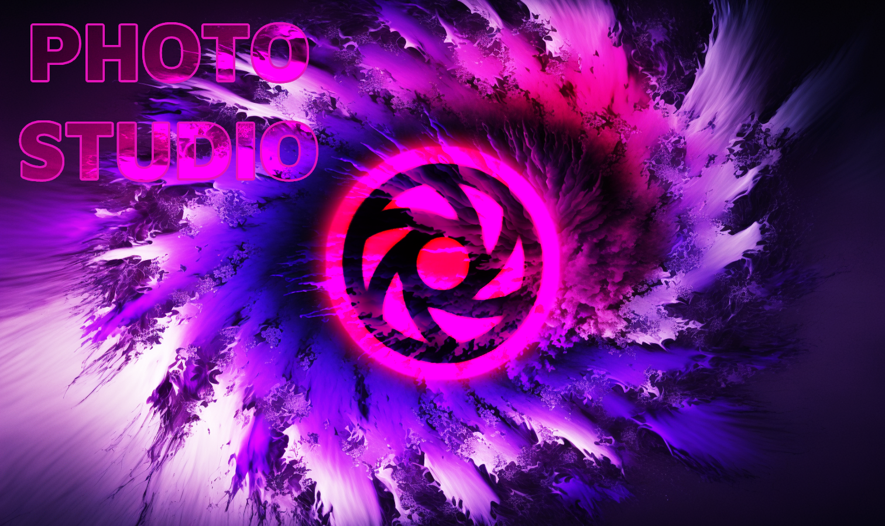
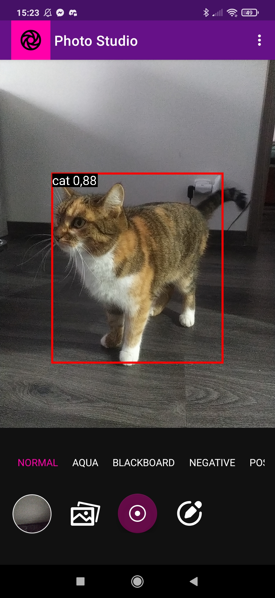
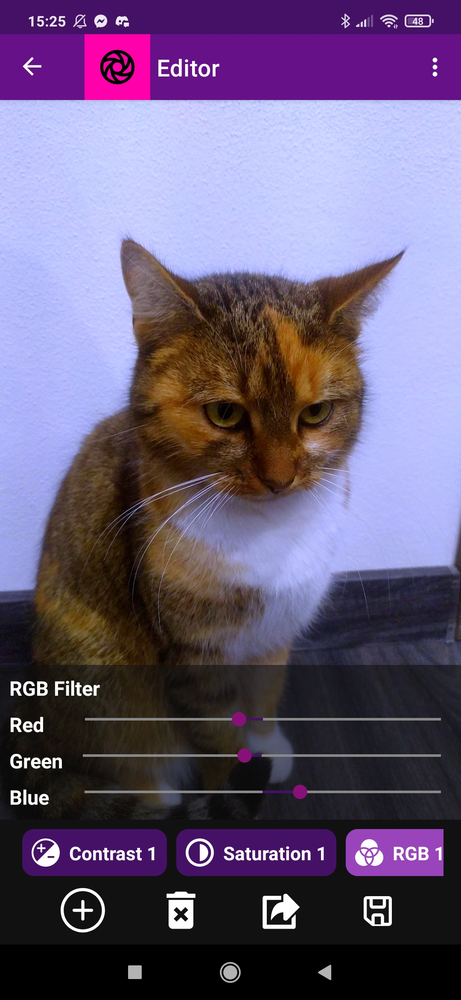

  
  
  
  

![TensorFlow]!(https://github.com/RushiChavan-dev/Android-Object-Detection/assets/50754786/3f1c80a6-a1e6-48ea-9bc9-66ff223cb8af)

  
# About
The application allows you to take photos and change image filters. All images are stored in the app's local gallery.
You can export any photo from your local gallery to your phone's main gallery. The app also has a photo editor. It allows you to change brightness, contrast, saturation and adjust RGB of any selected image from local gallery. It is possible to enable object detection and recognition (so far only a visual indication, in the next version it can trigger user-defined actions).

  
  

